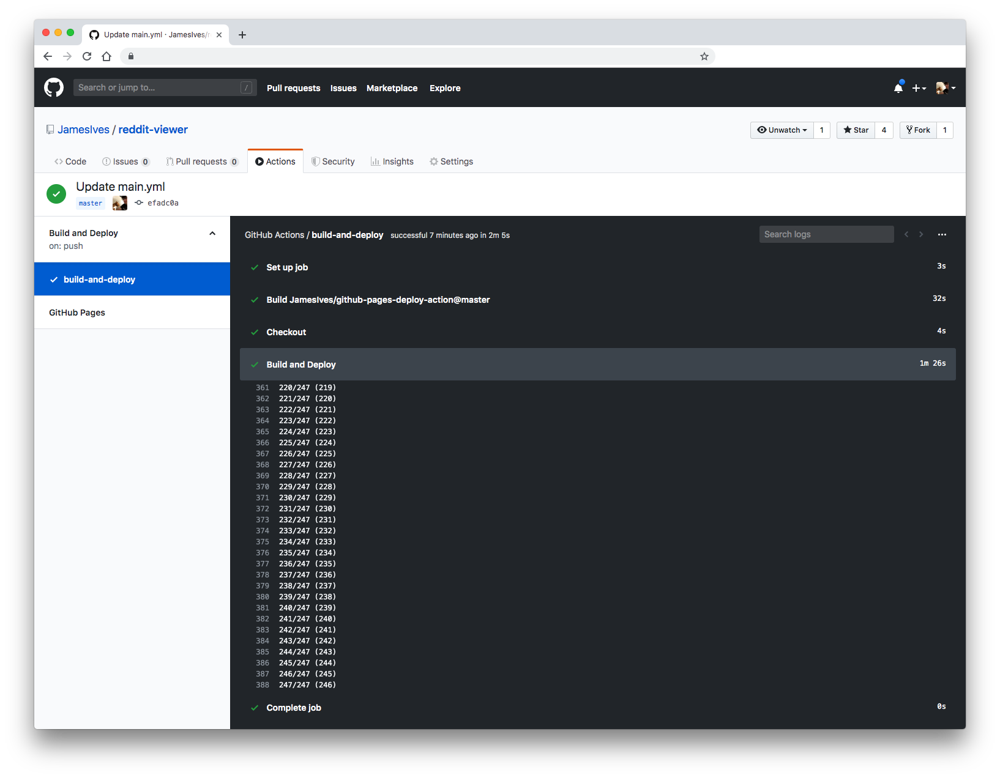

# GitHub Pages Deploy Action :rocket:

[](https://github.com/JamesIves/github-pages-deploy-action/actions) [](https://github.com/JamesIves/github-pages-deploy-action/actions) [](https://github.com/marketplace/actions/deploy-to-github-pages) [](https://github.com/JamesIves/github-pages-deploy-action/releases) [](https://codecov.io/gh/JamesIves/github-pages-deploy-action/branch/dev)

This [GitHub action](https://github.com/features/actions) will handle the deploy process of your project to [GitHub Pages](https://pages.github.com/). It can be configured to upload your production-ready code into any branch you'd like, including `gh-pages` and `docs`.



## Getting Started :airplane:

You can include the action in your workflow to trigger on any event that [GitHub actions supports](https://help.github.com/en/articles/events-that-trigger-workflows). If the remote branch that you wish to deploy to doesn't already exist the action will create it for you. Your workflow will also need to include the `actions/checkout` step before this workflow runs in order for the deployment to work.

You can view an example of this below.

```yml
name: Build and Deploy
on: [push]
jobs:
  build-and-deploy:
    runs-on: ubuntu-latest
    steps:
      - name: Checkout
        uses: actions/checkout@v2 # If you're using actions/checkout@v2 you must set persist-credentials to false in most cases for the deployment to work correctly.
        with:
          persist-credentials: false

      - name: Build and Deploy
        uses: JamesIves/github-pages-deploy-action@releases/v3
        with:
          ACCESS_TOKEN: ${{ secrets.ACCESS_TOKEN }}
          BRANCH: gh-pages # The branch the action should deploy to.
          FOLDER: build # The folder the action should deploy.
```

If you'd like to make it so the workflow only triggers on push events to specific branches then you can modify the `on` section.

```yml
on:
  push:
    branches:
      - master
```

#### Install as a Node Module 📦

If you'd like to use the functionality provided by this action in your own action you can install it using [yarn](https://yarnpkg.com/) by running the following command.

```
yarn add github-pages-deploy-action
```

It can then be imported into your project like so.

```javascript
import run, {
  init,
  deploy,
  generateBranch,
  actionInterface
} from "github-pages-deploy-action";
```

Calling the functions directly will require you to pass in an object containing the variables found in the configuration section, you'll also need to provide a `workspace` with a path to your project.

```javascript
import run from "github-pages-deploy-action";

run({
  folder: "build",
  branch: "gh-pages",
  workspace: "src/project/location",
  accessToken: process.env["ACCESS_TOKEN"]
});
```

For more information regarding the [action interface please click here](https://github.com/JamesIves/github-pages-deploy-action/blob/dev/src/constants.ts#L7).

## Configuration 📁

The `with` portion of the workflow **must** be configured before the action will work. You can add these in the `with` section found in the examples above. Any `secrets` must be referenced using the bracket syntax and stored in the GitHub repositories `Settings/Secrets` menu. You can learn more about setting environment variables with GitHub actions [here](https://help.github.com/en/articles/workflow-syntax-for-github-actions#jobsjob_idstepsenv).

#### Required Setup

One of the following deployment options must be configured.

| Key            | Value Information                                                                                                                                                                                                                                                                                                                                                                                                                                              | Type             | Required |
| -------------- | -------------------------------------------------------------------------------------------------------------------------------------------------------------------------------------------------------------------------------------------------------------------------------------------------------------------------------------------------------------------------------------------------------------------------------------------------------------- | ---------------- | -------- |
| `SSH`          | You can configure the action to deploy using SSH by setting this option to `true`. For more information on how to add your ssh key pair please refer to the [Using a Deploy Key section of this README](https://github.com/JamesIves/github-pages-deploy-action/tree/dev#using-an-ssh-deploy-key-).                                                                                                                                                            | `with`           | **Yes**  |
| `ACCESS_TOKEN` | Depending on the repository permissions you may need to provide the action with a GitHub personal access token instead of the provided GitHub token in order to deploy. You can [learn more about how to generate one here](https://help.github.com/en/articles/creating-a-personal-access-token-for-the-command-line). **This should be stored as a secret**.                                                                                                 | `secrets / with` | **Yes**  |
| `GITHUB_TOKEN` | In order for GitHub to trigger the rebuild of your page you must provide the action with the repositories provided GitHub token. This can be referenced in the workflow `yml` file by using `${{ secrets.GITHUB_TOKEN }}`. **Please note there is currently an issue affecting the use of this token which makes it so it only works with private repositories, [you can learn more here](https://github.com/JamesIves/github-pages-deploy-action/issues/5)**. | `secrets / with` | **Yes**  |

In addition to the deployment options you must also configure the following.

| Key      | Value Information                                                                                                                                                                                                                                             | Type   | Required |
| -------- | ------------------------------------------------------------------------------------------------------------------------------------------------------------------------------------------------------------------------------------------------------------- | ------ | -------- |
| `BRANCH` | This is the branch you wish to deploy to, for example `gh-pages` or `docs`.                                                                                                                                                                                   | `with` | **Yes**  |
| `FOLDER` | The folder in your repository that you want to deploy. If your build script compiles into a directory named `build` you'd put it here. **Folder paths cannot have a leading `/` or `./`**. If you wish to deploy the root directory you can place a `.` here. | `with` | **Yes**  |

#### Optional Choices

| Key                | Value Information                                                                                                                                                                                                                                                                                                                                     | Type   | Required |
| ------------------ | ----------------------------------------------------------------------------------------------------------------------------------------------------------------------------------------------------------------------------------------------------------------------------------------------------------------------------------------------------- | ------ | -------- |
| `GIT_CONFIG_NAME`  | Allows you to customize the name that is attached to the GitHub config which is used when pushing the deployment commits. If this is not included it will use the name in the GitHub context, followed by the name of the action.                                                                                                                     | `with` | **No**   |
| `GIT_CONFIG_EMAIL` | Allows you to customize the email that is attached to the GitHub config which is used when pushing the deployment commits. If this is not included it will use the email in the GitHub context, followed by a generic noreply GitHub email.                                                                                                           | `with` | **No**   |
| `REPOSITORY_PATH`       | Allows you to speicfy a different repository path so long as you have permissions to push to it. This shoul be formatted like so: `JamesIves/github-pages-deploy-action`.                                                                                                                                                                             | `with` | **No**   |
| `TARGET_FOLDER`    | If you'd like to push the contents of the deployment folder into a specific directory on the deployment branch you can specify it here.                                                                                                                                                                                                               | `with` | **No**   |
| `BASE_BRANCH`      | The base branch of your repository which you'd like to checkout prior to deploying. This defaults to the current commit [SHA](http://en.wikipedia.org/wiki/SHA-1) that triggered the build followed by `master` if it doesn't exist. This is useful for making deployments from another branch, and also may be necessary when using a scheduled job. | `with` | **No**   |
| `COMMIT_MESSAGE`   | If you need to customize the commit message for an integration you can do so.                                                                                                                                                                                                                                                                         | `with` | **No**   |
| `CLEAN`            | If your project generates hashed files on build you can use this option to automatically delete them from the deployment branch with each deploy. This option can be toggled on by setting it to `true`.                                                                                                                                              | `with` | **No**   |
| `CLEAN_EXCLUDE`    | If you need to use `CLEAN` but you'd like to preserve certain files or folders you can use this option. This should be formatted as an array but stored as a string. For example: `'["filename.js", "folder"]'`                                                                                                                                       | `with` | **No**   |
| `WORKSPACE`        | This should point to where your project lives on the virtual machine. The GitHub Actions environment will set this for you. It is only neccersary to set this variable if you're using the node module.                                                                                                                                               | `with` | **No**   |
| `DEBUG`            | By default the git commands are hidden from the log. If you'd like to turn them on you can toggle this to `true`. **If you're using this action in your own project as a node module via yarn or npm you may expose your secrets if you toggle this on in a production environment**.                                                                 | `with` | **No**   |

With the action correctly configured you should see the workflow trigger the deployment under the configured conditions.

---

### Using an SSH Deploy Key 🔑

If you'd prefer to use an SSH deploy key as opposed to a token you must first generate a new SSH key by running the following terminal command, replacing the email with one connected to your GitHub account.

```bash
ssh-keygen -t rsa -b 4096 -C "youremailhere@example.com" -N ""
```

Once you've generated the key pair you must add the contents of the public key within your repositories [deploy keys menu](https://developer.github.com/v3/guides/managing-deploy-keys/). You can find this option by going to `Settings > Deploy Keys`, you can name the public key whatever you want, but you **do** need to give it write access. Afterwards add the contents of the private key to the `Settings > Secrets` menu as `DEPLOY_KEY`.

With this configured you must add the `ssh-agent` step to your workflow and set `SSH` to `true` within the deploy action.

```yml
- name: Install SSH Client
  uses: webfactory/ssh-agent@v0.2.0
  with:
    ssh-private-key: ${{ secrets.DEPLOY_KEY }}

- name: Build and Deploy
  uses: JamesIves/github-pages-deploy-action@releases/v3
  with:
    SSH: true
    BRANCH: gh-pages
    FOLDER: site
```

<details><summary>You can view a full example of this here.</summary>
<p>

```yml
name: Build and Deploy
on:
  push:
    branches:
      - master
jobs:
  deploy:
    runs-on: ubuntu-latest
    steps:
      - name: Checkout
        uses: actions/checkout@v2
        with:
          persist-credentials: false

      - name: Install
        run: |
          npm install
          npm run-script build

      - name: Install SSH Client
        uses: webfactory/ssh-agent@v0.2.0 # This step installs the ssh client into the workflow run. There's many options available for this on the action marketplace.
        with:
          ssh-private-key: ${{ secrets.DEPLOY_KEY }}

      - name: Build and Deploy Repo
        uses: JamesIves/github-pages-deploy-action@releases/v3-test
        with:
          BASE_BRANCH: master
          BRANCH: gh-pages
          FOLDER: build
          CLEAN: true
          SSH: true # SSH must be set to true so the deploy action knows which protocol to deploy with.
```

</p>
</details>

---

### Operating System Support 💿

This action is primarily developed using [Ubuntu](https://ubuntu.com/). [In your workflow job configuration](https://help.github.com/en/actions/automating-your-workflow-with-github-actions/workflow-syntax-for-github-actions#jobsjob_idruns-on) it's recommended to set the `runs-on` property to `ubuntu-latest`.

```yml
jobs:
  build-and-deploy:
    runs-on: ubuntu-latest
```

If you're using an operating system such as [Windows](https://www.microsoft.com/en-us/windows/) you can workaround this using [artifacts](https://help.github.com/en/actions/automating-your-workflow-with-github-actions/persisting-workflow-data-using-artifacts). In your workflow configuration you can utilize the `actions/upload-artifact` and `actions/download-artifact` actions to move your project built on a Windows job to a secondary job that will handle the deployment.

<details><summary>You can view an example of this pattern here.</summary>
<p>

```yml
name: Build and Deploy
on: [push]
jobs:
  build:
    runs-on: windows-latest # The first job utilizes windows-latest
    steps:
      - name: Checkout
        uses: actions/checkout@v2
        with:
          persist-credentials: false

      - name: Install # The project is built using npm and placed in the 'build' folder.
        run: |
          npm install
          npm run-script build

      - name: Upload Artifacts # The project is then uploaded as an artifact named 'site'.
        uses: actions/upload-artifact@v1
        with:
          name: site
          path: build

  deploy:
    needs: [build] # The second job must depend on the first one to complete before running, and uses ubuntu-latest instead of windows.
    runs-on: ubuntu-latest
    steps:
      - name: Checkout
        uses: actions/checkout@v2
        with:
          persist-credentials: false

      - name: Download Artifacts # The built project is downloaded into the 'site' folder.
        uses: actions/download-artifact@v1
        with:
          name: site

      - name: Build and Deploy
        uses: JamesIves/github-pages-deploy-action@releases/v3
        with:
          ACCESS_TOKEN: ${{ secrets.ACCESS_TOKEN }}
          BRANCH: gh-pages
          FOLDER: "site" # The deployment folder should match the name of the artifact. Even though our project builds into the 'build' folder the artifact name of 'site' must be placed here.
```

</p>
</details>

---

### Using a Container 🚢

If you use a [container](https://help.github.com/en/actions/automating-your-workflow-with-github-actions/workflow-syntax-for-github-actions#jobsjob_idcontainer) in your workflow you may need to run an additional step to install `rsync` as this action depends on it. You can view an example of this below.

```yml
- name: Install rsync
  run: |
    apt-get update && apt-get install -y rsync

- name: Deploy
  uses: JamesIves/github-pages-deploy-action@releases/v3
```

---

### Additional Build Files 📁

This action maintains the full Git history of the deployment branch. Therefore if you're using a custom domain and require a `CNAME` file, or if you require the use of a `.nojekyll` file, you can safely commit these files directly into deployment branch without them being overridden after each deployment.
